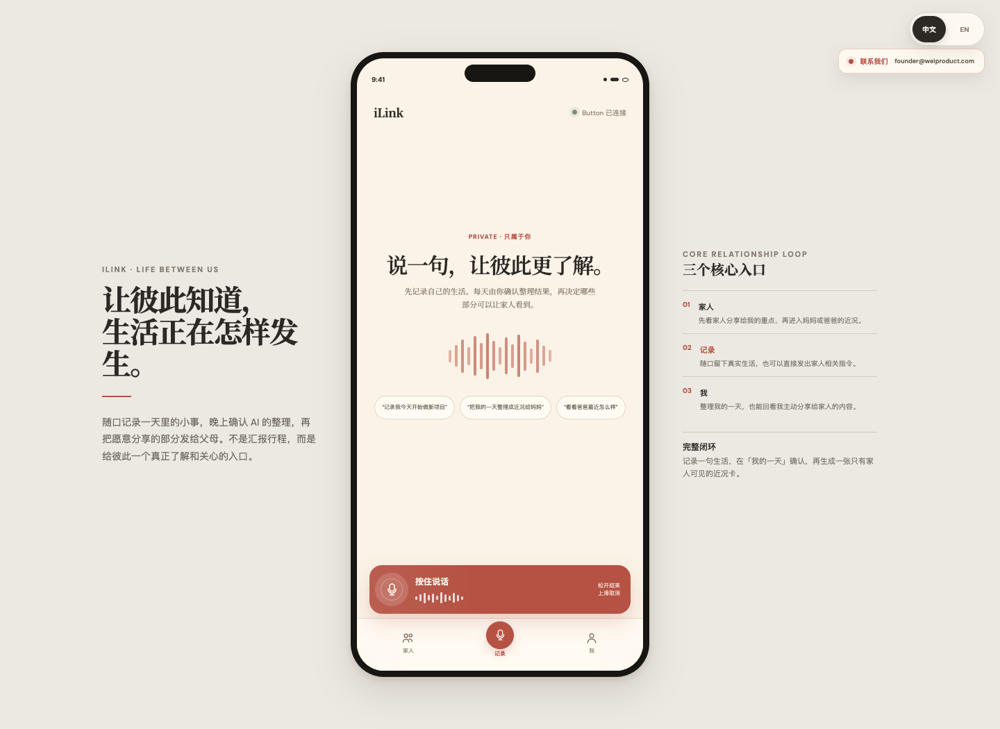
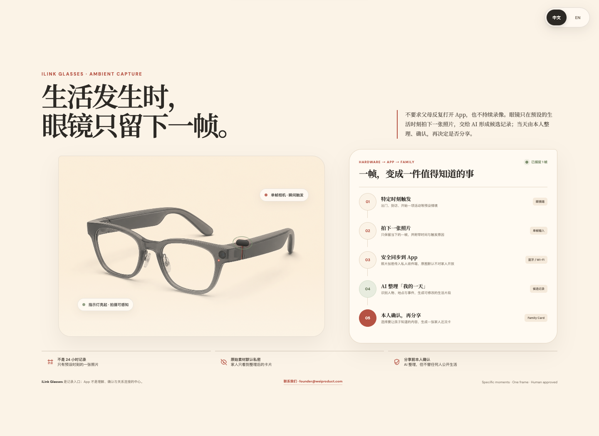

# iLink

iLink 是一个面向父母与成年子女的 AI 生活记录与分享产品原型。

它通过低摩擦的语音输入和智能眼镜记录生活片段，由 AI 整理成「我的一天」，再由本人确认哪些内容可以分享给家人。产品的核心不是监控，而是在隐私可控的前提下，让彼此更了解对方的日常。





## 核心流程

1. 使用语音或智能眼镜记录一个生活时刻。
2. AI 将输入整理为可修改的生活片段。
3. 用户在「我的一天」中确认整理结果。
4. 用户选择内容，生成并发送家人近况卡。
5. 家人只能看到对方主动确认并分享的内容。

## 体验原型

在线访问：[https://galigeege.github.io/ilink/](https://galigeege.github.io/ilink/)

直接在浏览器打开 [`ilink-app-prototype.html`](ilink-app-prototype.html)。

- 第一屏：可交互的 App 原型
- 向下滚动：智能眼镜与 App 的交互闭环
- 右上角：中文 / English 切换
- 眼镜页面：点击镜腿按钮可体验单帧记录反馈

## 隐私原则

- 原始记录默认私密
- 家人只看到整理后的分享卡片
- AI 负责整理，不代替用户公开生活
- 分享前由本人确认

## 文件说明

- `ilink-app-prototype.html`：完整可交互 App 与硬件流程原型
- `ilink-smart-glasses.png`：智能眼镜视觉素材
- `ilink-product-ui-directions.md`：产品与 UI 设计说明
- `ilink-ui-directions.html`：早期 UI 方向展示
- `render-app-prototype.mjs`：Playwright 原型验证与截图脚本

## 本地验证

渲染脚本依赖 Playwright 与可用的 Chromium/Chrome 环境。根据本机依赖路径调整脚本后运行：

```bash
node render-app-prototype.mjs
```

当前仓库是 Hackathon 产品原型，不包含正式生产后端、账号系统或真实硬件固件。

## 联系我们

[founder@weiproduct.com](mailto:founder@weiproduct.com)
